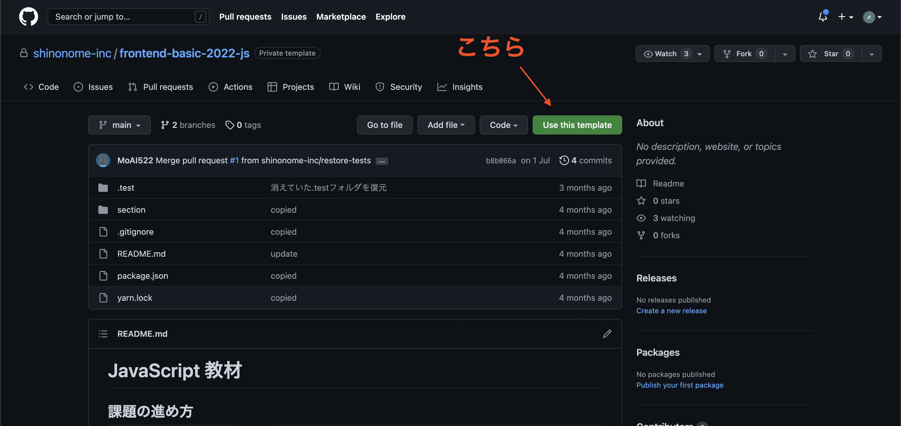
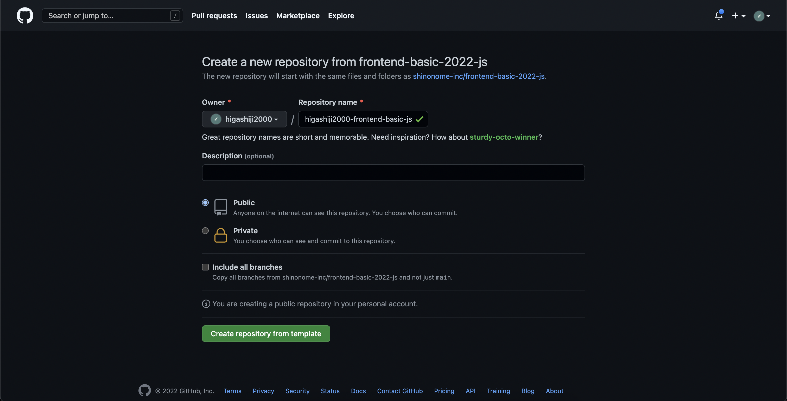

# JavaScript 教材

## 準備

右上の Use This Template ボタンから、自分のリポジトリを作成してください。



ownerは自分を設定してください。
リポジトリ名に指定はありません。



以降はここでクローンした自分のリポジトリを編集していきます。

## 課題の進め方

教材一覧に掲示されているものを読んでいき、JavaScriptについての理解を深めましょう。

各チャプターには問題が用意されており、これら全てに正解することでこの課題は終了となります。

問題の回答方法は都度指示がありますが、基本的にはsectionフォルダ内の該当するセクションのフォルダに.jsファイルが入っており、その中に実際にJavaScriptを書いて回答することとなります。

回答の正誤は、プロジェクトルートディレクトリで以下のコマンドを実行することで確認できます。
```
(初回のみ)
yarn install

(testNのNはセクション番号)
yarn testN
```

### 注意点

本課題にはレビューがありません。  
自分の回答をpushするかどうかは任意です。  
質問は他の課題と同様の手順で行なってください。

---

## 教材一覧

1. JavaScript の基礎 [問題](./section/section1/README.md)

- [コメント](https://jsprimer.net/basic/comments/)
- [変数と宣言](https://jsprimer.net/basic/variables/)

2. console の使用方法 [問題](./section/section2/README.md)

- [値の評価と表示](https://jsprimer.net/basic/read-eval-print/)

3. データの型、演算子、型について [問題](./section/section3/README.md)

- [データ型とリテラル](https://jsprimer.net/basic/data-type/)
- [演算子](https://jsprimer.net/basic/operator/)
- [暗黙的な型変換](https://jsprimer.net/basic/implicit-coercion/)

4. 関数 [問題](./section/section4/README.md)

- [関数と宣言](https://jsprimer.net/basic/function-declaration/)
- [文と式](https://jsprimer.net/basic/statement-expression/)

5. 条件分岐 [問題](./section/section5/README.md)

- [条件分岐](https://jsprimer.net/basic/condition/)

6. ループと反復処理 [問題](./section/section6/README.md)

- [ループと反復処理](https://jsprimer.net/basic/loop/)

7. オブジェクト [問題](./section/section7/README.md)

- [オブジェクト](https://jsprimer.net/basic/object/)

8. 配列 [問題](./section/section8/README.md)

- [配列](https://jsprimer.net/basic/array/)

9. まとめのテスト [問題](./section/section9/README.md)

section4以降の課題に関しては補助教材:JavaScript課題解説を作成しているので行き詰ったときは参考にしてみてください。
[JavaScript課題解説](https://shinonome-inc.notion.site/JavaScript-1539e836b1cb467f9156742e1d1b43c9)
補助教材とはchatGPTを使用して作成されたコース課題を進める上で手助けになる教材です。情報等間違っている可能性がありますのでご了承ください。
